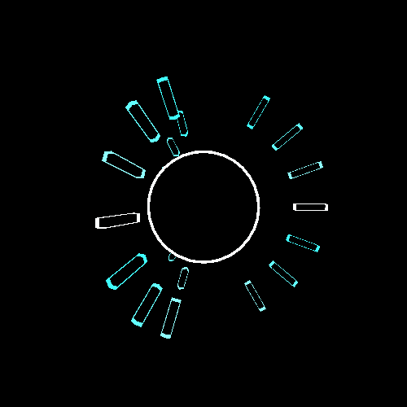

*Note: This script is deprecated in favor of [**Modular Modifier**](https://github.com/ianharmon/modular-modifier).*

# GIF Glitcher

## Description

This is a port of previous GIF-glitching experiments in Python/Imagemagick to Processing. The types of glitches that are done are:

  * From random frames, one of the color channels is selected and then swapped with the same channel of an adjacent frame
  * From random frames or random channels within frames, blocks of image data are swapped with another block within the same frame
  * Some frames (or channels of frames, by default) are encoded to JPEG and then have bytes randomly removed, corrupting the image. These are then decoded back into the frame.

## Requirements

This script was tested on [Processing 2.2.1](https://www.processing.org/download/) and also requires the [gifAnimation library](http://extrapixel.github.io/gif-animation/) which can be downloaded from within the Processing IDE.

## Usage

With the script loaded in Processing, have a GIF named `input.gif` in the same directory. Run the script and the glitched version will be generated. To save the output to GIF, press any key and it will be saved `output.gif`.

## Known Issues

  * Rarely, the JPEG corruption can fail and prevent the script from finishing. Usually you can just run the script again.

## Version History

### 2014-05-25 - v1

  * initial version
